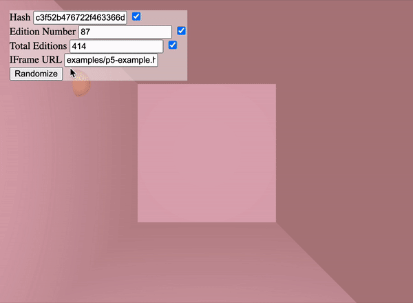

# verse generative example

## Introduction

This repository demostrates an example code for generative project of how to access hash and other parameters such as edition number and total number of editions.

You can use `index.html` as a starting project.

## Playground



To test your project with different parameters you can open `playground.html` and provide your _IFrame URL_. This file may be locally on your computer or online.

We will be improving playground as we go to add new variables and examples.

### Examples

You can try running few example projects on Playground using _IFrame URL_ below

Basic example - [http://playground-generative.s3-website-eu-west-1.amazonaws.com/examples/basic.html](http://playground-generative.s3-website-eu-west-1.amazonaws.com/examples/basic.html)

p5js example - [http://playground-generative.s3-website-eu-west-1.amazonaws.com/examples/p5-example.html](http://playground-generative.s3-website-eu-west-1.amazonaws.com/examples/p5-example.html)

Note - playground options appear on hover.

## Instructions

Verse system will need to hash and other parameters to your project's  
`index.html` during minting. To allow your code accept these parameters you should include following `javascript` code.

```js
// Parse payload from query params
const q = new URLSearchParams(window.location.search).get("payload");
const p = JSON.parse(q ? atob(q) : "{}");

// Use available payload variables in your code
const hash = p.hash || "0";
const editionNumber = p.editionNumber || 1;
const totalEditions = p.totalEditions || 1;
```

After that you can use Playground to test.

## Examples

There are few examples in `examples/` folder
